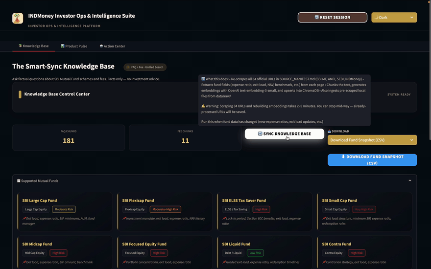
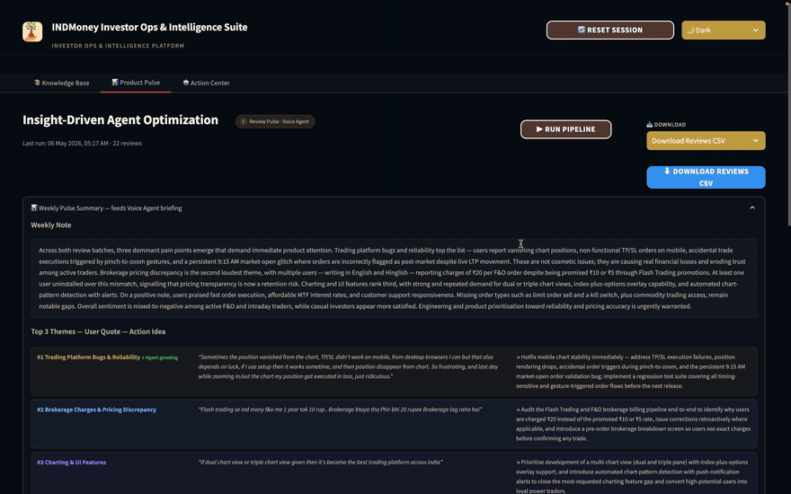
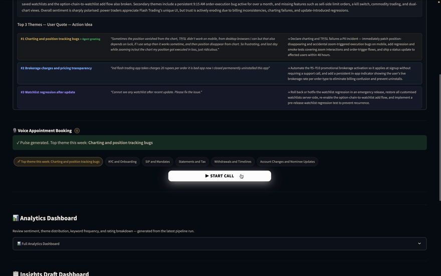
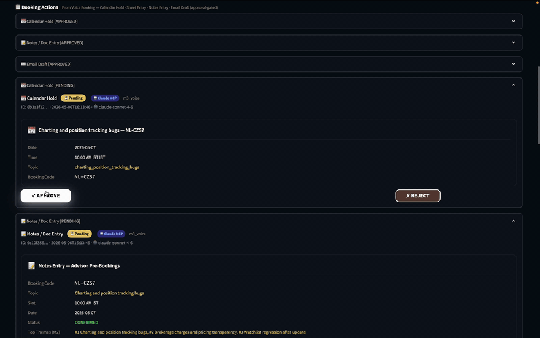

# Investor Ops & Intelligence Suite
### INDMoney — AI Bootcamp Capstone

A unified three-pillar dashboard that merges a RAG FAQ chatbot (M1), a review intelligence pipeline (M2), and a voice appointment scheduler (M3) into a single Streamlit application.

**Live Deployment:** [investor-ops-and-intelligence-suite-production.up.railway.app](https://investor-ops-and-intelligence-suite-production.up.railway.app/)

---

## Demo

🎥 **Full walkthrough:** [Watch on Google Drive](https://drive.google.com/file/d/1vTIdE5VQbvHkL6Jqe0blD97z8PjRzT5g/view?usp=sharing)

| Pillar | Preview |
|---|---|
| **Smart-Sync FAQ** — per-fund priority URL chain (Groww → INDMoney → SBI MF) → mfapi.in fallback |  |
| **Insight-Driven Optimization** — weekly review pipeline → themes, pulse, fee explainer |  |
| **Voice Booking Agent** — book / reschedule / cancel; PII scrub; compliance gate |  |
| **Super-Agent MCP Workflow** — Claude enqueues 4 actions; HITL approval |  |

> GIFs are sliced from the demo video by [`scripts/make_demo_gifs.py`](scripts/make_demo_gifs.py).
> Edit the `SCENES` list in that script (start time + duration per scene), download the demo
> as `assets/demo.mp4`, then `python scripts/make_demo_gifs.py`. Requires `ffmpeg`.

---

## Capstone Submission

| Deliverable | Link |
|---|---|
| Live Deployment | [investor-ops-and-intelligence-suite-production.up.railway.app](https://investor-ops-and-intelligence-suite-production.up.railway.app/) |
| GitHub Repository | https://github.com/manishkumar98/investor-ops-and-intelligence-suit |
| Demo Video | [Watch on Google Drive](https://drive.google.com/file/d/1vTIdE5VQbvHkL6Jqe0blD97z8PjRzT5g/view?usp=sharing) |
| Evals Report | [EVALS_REPORT.md](EVALS_REPORT.md) |
| Source Manifest (42 URLs) | [SOURCE_MANIFEST.md](SOURCE_MANIFEST.md) |
| Sample Q&A (10 queries) | [SAMPLE_QA.md](SAMPLE_QA.md) |
| Weekly Product Pulse & Fee Explainer | [Google Doc](https://docs.google.com/document/d/1erfYuwVB6nNieTNwjxO6cTX9Be2FIXg6rQiEfSov0so/edit?tab=t.0) |
| Advisor Booking Sheet | [Google Sheet](https://docs.google.com/spreadsheets/d/1rIGbbWXwfEJW7Y77iFGqpjbN5UK_Ef1gJMM6O6asJiI/edit?gid=0#gid=0) |

---

## Setup

### 1. Install dependencies
```bash
pip install -r requirements.txt
python -m spacy download en_core_web_sm
```

### 2. Configure environment
```bash
cp .env.example .env
# Fill in ANTHROPIC_API_KEY and OPENAI_API_KEY
```

### 3. Ingest the corpus
```bash
python scripts/ingest_corpus.py
```
Builds the RAG corpus for all 12 SBI Mutual Fund schemes from three sources:
- **42 live URLs** from `SOURCE_MANIFEST.md` (sbimf.com, Groww, INDMoney, AMFI, SEBI, MFCentral) — some may be blocked; failures are handled gracefully
- **Local raw files** in `data/raw/` — pre-authored `.txt` files for all 12 funds (official, INDMoney, Groww variants) plus AMFI education and SEBI regulatory content; always succeeds, no network dependency
- **mfapi.in (AMFI live data)** — `mfapi_loader.py` fetches live NAV + calculated 1Y/3Y/5Y returns for all 12 funds directly from AMFI via `api.mfapi.in`; no API key, no scraping, no blocks

All data is chunked, embedded with OpenAI `text-embedding-3-small` (fallback: `all-MiniLM-L6-v2`), and stored in ChromaDB under `data/chroma/`. Structured fields (AUM, NAV, exit load, expense ratio, etc.) are also written to `data/fund_snapshot.json`.

Use `--force` to re-fetch even if the source list hasn't changed.

> **Important:** The embedding model is locked at first ingest. Do not switch `OPENAI_API_KEY` between ingests without deleting `data/chroma/` first.

### 4. Run the app
```bash
streamlit run app.py
```

---

## Architecture

```
app.py  (single entry point)
├── Tab 1 — Smart-Sync Knowledge Base      → phase5_pillar_a_faq/faq_engine.py
├── Tab 2 — Insight-Driven Optimization    → phase3_review_pillar_b/pipeline_orchestrator.py
│                                            + phase4_voice_pillar_b/voice_agent.py
└── Tab 3 — Super-Agent MCP Workflow       → phase7_pillar_c_hitl/hitl_panel.py
```

| Phase | Pillar | Modules | Adapted From |
|---|---|---|---|
| Phase 2 | Corpus (Pillar A) | url_loader, chunker, embedder, ingest, structured_extractor | M1 RAG corpus build |
| Phase 5 | FAQ (Pillar A) | safety_filter, query_router, retriever, llm_fusion, faq_engine | M1 RAG chatbot |
| Phase 3 | Review (Pillar B) | pii_scrubber, theme_clusterer, quote_extractor, pulse_writer, fee_explainer, pipeline_orchestrator | M2 review pipeline |
| Phase 4 | Voice (Pillar B) | intent_classifier, slot_filler, booking_engine, voice_agent | M3 voice agent |
| Phase 7 | HITL (Pillar C) | mcp_client, email_builder, hitl_panel | New — approval gate |

---

## Key Technical Decisions

| Decision | Choice | Reason |
|---|---|---|
| LLM | `claude-sonnet-4-6` | Capstone requirement (all M1/M2/M3 used Groq) |
| Embeddings | OpenAI `text-embedding-3-small` (1536 dim) | Better quality than ChromaDB default (M1) |
| TTS | OpenAI `tts-1`, voice=alloy | Replaces Google Cloud TTS from M3 |
| ASR | OpenAI `whisper-1` | Replaces Google/Deepgram from M3 |
| Voice FSM | 7 states | Reduced from M3's 16 states per capstone spec |
| MCP approvals | Streamlit HITL panel | Replaces M2 terminal Y/N and M3 auto-execute |
| Calendar | Mock JSON | Replaces M3's live Google Calendar API |

---

## Complete User Flow

### Prerequisites (one-time)
```bash
python scripts/ingest_corpus.py   # build ChromaDB corpus
streamlit run app.py              # launch the app
```

---

### Step 1 — App loads (automatic)
- NAV ticker appears at the top with live fund prices
- HuggingFace embedding model pre-warms silently in the background
- Sidebar shows corpus status (FAQ + Fee chunk counts) and pending approvals count

---

### Step 2 — Tab 2 · Insight-Driven Optimization — Run the Pipeline
> Must do this before starting a voice call; Tab 1 works independently at any time.

1. Click **▶ Run Pipeline**
2. System scrapes INDMoney reviews → Claude analyzes them → generates the **Weekly Pulse** (top themes, quotes, sentiment)
3. Sidebar updates: *"Top theme: Nominee Updates"*
4. Dashboard HTML appears: review analytics, sentiment breakdown, action recommendations, fee context bullets

---

### Step 3 — Tab 1 · Smart-Sync Knowledge Base — Ask a question (anytime)

1. Type a factual question, e.g. *"What is the exit load for SBI ELSS and why was I charged it?"*
2. System searches **both** M1 (FAQ corpus) and M2 (Fee corpus) simultaneously
3. Returns a **6-bullet answer**: exit load %, expense ratio, lock-in rules, redemption terms
4. Source citations from `sbimf.com` (M2 official) and `indmoney.com` (M1 FAQ)

---

### Step 4 — Tab 2 · Insight-Driven Optimization — Start a Voice Call

1. Click **▶ Start Call** (enabled after pipeline has run)
2. Agent delivers a **theme-aware greeting**: *"I see many users are asking about Nominee Updates today — I can help you book a call for that!"*
3. User speaks their topic → preferred date/time → agent confirms a slot
4. Booking confirmed → agent speaks the booking code (NL-XXXX format)
5. **Behind the scenes (automatic, no approval needed):**
   - Google Calendar event created immediately (background thread)
   - Google Sheets row logged immediately (background thread)
6. Terminal banner appears: *"✓ Appointment booked! Code: NL-XXXX — Check the Super-Agent MCP Workflow tab"*
7. Sidebar **Pending Approvals** counter jumps to **3**

---

### Step 5 — Tab 3 · Action Center — Review & Approve
> Nothing executes until you approve it here. All 5 MCP actions are approval-gated in one unified center.

The Action Center consolidates actions from both M2 and M3 into two groups:

#### 📊 Weekly Pulse Actions (generated after Run Pipeline)

| Action | What it is | Fires on Approval |
|---|---|---|
| 📝 Notes / Doc Append | Weekly pulse + fee scenario | Appends to [Weekly Product Pulse Doc](https://docs.google.com/document/d/1erfYuwVB6nNieTNwjxO6cTX9Be2FIXg6rQiEfSov0so/edit?tab=t.0) |
| ✉️ Email Draft | Weekly pulse + fee explainer | SMTP-sends to advisor (`manish98ad@gmail.com`) |

#### 📋 Booking Actions (generated after Voice Booking)

| Action | What it is | Fires on Approval |
|---|---|---|
| 📅 Calendar Hold | Tentative advisor slot | Creates Google Calendar event |
| 📝 Notes Entry | Booking record (topic, slot, code + M2 pulse context) | Appends to [Weekly Product Pulse Doc](https://docs.google.com/document/d/1erfYuwVB6nNieTNwjxO6cTX9Be2FIXg6rQiEfSov0so/edit?tab=t.0) |
| 📊 Google Sheet Entry | Booking log row (code, topic, slot, date, status) | Appends row to [Advisor Booking Sheet](https://docs.google.com/spreadsheets/d/1rIGbbWXwfEJW7Y77iFGqpjbN5UK_Ef1gJMM6O6asJiI/edit?gid=0#gid=0) |
| ✉️ Email Draft | Advisor email with booking details + Weekly Pulse Market Context | SMTP-sends to advisor (`manish98ad@gmail.com`) |

For the **M3 Email Draft**: fill in Client Name + Client Email → click **✓ Approve & Send Email**
- Advisor email includes the full Weekly Review Pulse so they know current customer sentiment before the meeting *(The Twist from Pillar C)*
- Client confirmation email fires to the address you entered

---

## MCP Actions Reference

The system uses **Model Context Protocol (MCP)** for all external integrations. Every action is approval-gated — no external call fires until a human clicks **Approve** in the Action Center.

### All 5 Required MCP Actions

| # | Action | Source | Tool | Destination |
|---|---|---|---|---|
| 1 | 📝 Notes / Doc Append | M2 pipeline | `docs_tool.append_notes_sync()` | [Weekly Product Pulse Doc](https://docs.google.com/document/d/1erfYuwVB6nNieTNwjxO6cTX9Be2FIXg6rQiEfSov0so/edit?tab=t.0) |
| 2 | ✉️ Email Draft | M2 pipeline | `mcp_client._send_advisor_email_live()` | Advisor inbox |
| 3 | 📅 Calendar Hold | M3 voice | `calendar_tool.create_calendar_hold()` | Google Calendar |
| 4 | 📝 Notes Entry | M3 voice | `docs_tool.append_notes_sync()` | [Weekly Product Pulse Doc](https://docs.google.com/document/d/1erfYuwVB6nNieTNwjxO6cTX9Be2FIXg6rQiEfSov0so/edit?tab=t.0) |
| 5 | ✉️ Email Draft | M3 voice | `mcp_client._send_advisor_email_live()` | Advisor inbox |

**Bonus (not required by PS):**
| + | 📊 Sheet Entry | M3 voice | `sheets_tool._append_row_sync()` | [Advisor Booking Sheet](https://docs.google.com/spreadsheets/d/1rIGbbWXwfEJW7Y77iFGqpjbN5UK_Ef1gJMM6O6asJiI/edit?gid=0#gid=0) |

### MCP Execution Flow

```
── M2: Run Pipeline ──────────────────────────────────────────────
Pipeline completes
      ↓
2 actions enqueued (status: pending)
  notes_append  → Weekly pulse + fee payload
  email_draft   → Weekly pulse + fee email body

── M3: Voice Booking ─────────────────────────────────────────────
Voice call ends
      ↓
Super-Agent (Claude via tool_use) generates 4 action payloads
      ↓
4 actions enqueued (status: pending)
  calendar_hold → Slot details
  notes_append  → Booking record + M2 pulse context
  sheet_entry   → Booking log row
  email_draft   → Booking details + Market Context (from M2 pulse)

── Action Center (Tab 3) ─────────────────────────────────────────
Advisor reviews both groups → clicks Approve on each
      ↓
MCPClient.execute() fires per action:
  notes_append   → Google Docs API
  email_draft    → Gmail SMTP
  calendar_hold  → Google Calendar API
  sheet_entry    → Google Sheets API
```

### Mock vs Live Mode

Set `MCP_MODE=mock` (default) for local development — all actions are recorded in memory, no external APIs called. Set `MCP_MODE=live` with the required credentials to fire real Google API and SMTP calls.

---

### Flow Summary

```
Knowledge Base (Tab 1)       Product Pulse (Tab 2)           Action Center (Tab 3)
──────────────────           ─────────────────────           ─────────────────────
Ask FAQ question      ←→     Run Pipeline              →  📊 Weekly Pulse Actions:
  ↓                            (M2 Weekly Pulse)              📝 Notes/Doc append
6-bullet answer                2 actions queued               ✉️ Email Draft
with source links
from M1 + M2                 Start Voice Call           →  📋 Booking Actions:
                               (M3 briefed by M2)            📅 Calendar Hold
                               Theme-aware greeting           📝 Notes Entry
                               Booking confirmed              📊 Sheet Entry
                               4 actions queued               ✉️ Email Draft
                                                              (with M2 pulse inside)
                                                              ↓
                                                           Approve all → APIs fire
```

---

## Sample Queries (M1 Tested)

See [docs/sample_queries.md](docs/sample_queries.md) for verified Q&A pairs tested end-to-end on 2026-04-24, covering:
- Expense ratio, exit load, minimum SIP, lock-in, riskometer, benchmark
- Capital gains statement download with fund-specific CAMS links
- Known gaps and how to fix them

---

## Running Evals

```bash
python phase8_eval_suite/evals/run_evals.py
```

Expected output:
- Safety: 3/3 PASS (hard gate — failure = exit code 1)
- UX: 3/3 PASS
- RAG: ≥4/5 faithful, ≥4/5 relevant
- `EVALS_REPORT.md` generated in project root

---

## Environment Variables

| Variable | Required | Default | Purpose |
|---|---|---|---|
| `ANTHROPIC_API_KEY` | Yes | — | All LLM calls (claude-sonnet-4-6) |
| `OPENAI_API_KEY` | Yes | — | Embeddings (text-embedding-3-small) + TTS (tts-1) + ASR (whisper-1) |
| `CHROMA_PERSIST_DIR` | No | `./data/chroma` | ChromaDB storage path |
| `MCP_MODE` | No | `live` | `mock` (in-memory only) or `live` (SMTP email + Google APIs) |
| `MCP_SERVER_URL` | No | `http://localhost:3000` | Live MCP server base URL |
| `SECURE_BASE_URL` | No | `https://app.example.com` | Base URL for booking completion links |
| `ADVISOR_EMAIL` | No | `GMAIL_ADDRESS` | Recipient for advisor pre-booking emails (e.g. `manish98ad@gmail.com`) |
| `GMAIL_ADDRESS` | No | — | Gmail account used for sending emails |
| `GMAIL_APP_PASSWORD` | No | — | Gmail app password (16-char, no spaces) |
| `ROUTER_MODE` | No | `keyword` | FAQ query routing: `keyword` or `llm` |

---

## Utility Scripts

```bash
# Health check (API key, ChromaDB, corpus freshness, disk)
python scripts/health_monitor.py

# Backup chroma + snapshots to data/backups/ (keeps last 5)
python scripts/backup_data.py
```

## Source Manifest & Data Sources

The knowledge base is built from three layers:

| Layer | Where | What |
|---|---|---|
| **Live URL scraping** | `SOURCE_MANIFEST.md` (42 URLs) | sbimf.com, Groww, INDMoney, AMFI, SEBI, MFCentral — scraped on every Sync KB |
| **Local raw files** | `data/raw/*.txt` (35+ files) | Pre-authored for all 12 funds: `*official*`, `*indmoney*`, `*groww*` variants + AMFI education + SEBI regulatory |
| **mfapi.in live API** | `phase2_corpus_pillar_a/mfapi_loader.py` | Fetches live NAV + 1Y/3Y/5Y returns from AMFI via `api.mfapi.in` on every Sync — no API key, no scraping, no blocks |

To add a new URL: prefix with `mf_faq:` or `fee:` in `SOURCE_MANIFEST.md`, then re-run `ingest_corpus.py --force` or click **Sync Knowledge Base** in the app.

---

## Project Structure

```
investor_ops-and-intelligence_suit/
├── app.py                          # Main entry point (Streamlit)
├── config.py                       # Env vars + SESSION_KEYS
├── session_init.py                 # Idempotent session initialiser
├── SOURCE_MANIFEST.md              # 42 URLs for live scraping (mf_faq: / fee: prefixes)
├── requirements.txt                # Python dependencies
│
├── phase1_foundation/              # Infrastructure (config, session, ChromaDB init)
│   ├── prd/ architecture/ tests/ evals/
│
├── phase2_corpus_pillar_a/         # Corpus ingestion (M1 RAG build)
│   ├── url_loader.py               # Fetch + collapse page text
│   ├── chunker.py                  # Text chunker + structured chunk builder
│   ├── embedder.py                 # OpenAI / local sentence-transformer embedder
│   ├── ingest.py                   # Full ingest pipeline → ChromaDB + fund_snapshot.json
│   ├── mfapi_loader.py             # Live NAV + returns via api.mfapi.in (AMFI) — no scraping
│   ├── structured_extractor.py     # Regex field extractor (14 named slots per fund, all 12 funds)
│   └── prd/ architecture/ tests/ evals/
│
├── phase3_review_pillar_b/         # Review pipeline (M2 adapted)
│   ├── pii_scrubber.py
│   ├── theme_clusterer.py
│   ├── quote_extractor.py
│   ├── pulse_writer.py
│   ├── fee_explainer.py
│   ├── pipeline_orchestrator.py
│   └── prd/ architecture/ tests/ evals/
│
├── phase4_voice_pillar_b/          # Voice agent (M3 adapted)
│   ├── intent_classifier.py
│   ├── slot_filler.py
│   ├── booking_engine.py
│   ├── voice_agent.py
│   └── prd/ architecture/ tests/ evals/
│
├── phase5_pillar_a_faq/            # FAQ engine (M1 chatbot)
│   ├── safety_filter.py            # Pre-filter: blocks advice/PII before retrieval
│   ├── query_router.py             # Routes to mf_faq / fee / both collections
│   ├── retriever.py                # Embeds query, retrieves + distance-filters chunks
│   ├── llm_fusion.py               # Claude fusion → FaqResponse (bullets/prose/sources)
│   ├── faq_engine.py               # Pipeline orchestrator (safety→route→retrieve→fuse)
│   └── prd/ architecture/ tests/ evals/
│
├── phase7_pillar_c_hitl/           # HITL approval center
│   ├── mcp_client.py
│   ├── email_builder.py
│   ├── hitl_panel.py
│   └── prd/ architecture/ tests/ evals/
│
├── phase8_eval_suite/              # Evaluation suite
│   └── evals/
│       ├── run_evals.py
│       ├── safety_eval.py
│       ├── rag_eval.py
│       ├── ux_eval.py
│       ├── report_generator.py
│       ├── golden_dataset.json
│       └── adversarial_tests.json
│
├── scripts/
│   ├── ingest_corpus.py            # CLI: python scripts/ingest_corpus.py [--force]
│   ├── health_monitor.py           # 7-check health monitor → data/system_state.json
│   └── backup_data.py              # Backs up chroma + snapshots (keeps last 5)
│
└── data/
    ├── chroma/                     # ChromaDB (created by ingest)
    ├── raw/                        # 35+ fund txt files (official/indmoney/groww/mfapi variants)
    ├── fund_snapshot.json          # Structured fields for all funds (written on ingest)
    ├── nav_snapshot.json           # NAV + prev_nav for ticker display
    ├── system_state.json           # Last ingest / backup / health-check timestamps
    ├── reviews_sample.csv          # Sample reviews for pipeline demo
    ├── mock_calendar.json          # Mock appointment slots
    └── mcp_state.json              # MCP action queue
```

---

## Review Scraping

Reviews are scraped from the **Google Play Store** using the open-source `google-play-scraper` library (no API key required). The target app is INDMoney (`com.indmoney.indstocks`).

### How it works

1. Fetches up to 400 reviews per star rating (1–5★) × 2 sort orders (MOST_RELEVANT + NEWEST) → up to 4,000 raw reviews
2. Deduplicates by `review_id`, drops reviews under 5 words
3. Caps at **1,000 reviews** with proportional rating distribution
4. Saves to `data/reviews_latest.csv`

### When it runs

**Only when you click "▶ Run Pipeline" in Tab 2** — it is not automatic. The live scrape is Step 1 of the pipeline. If the scrape returns nothing (rate-limited or no network), the pipeline falls back automatically to `data/reviews_sample.csv`.

### Corpus scraping (FAQ / fund facts)

The corpus scraper (`python scripts/ingest_corpus.py`) is also manual. It uses a SHA-256 hash of the URL list in `SOURCE_MANIFEST.md` — if the list hasn't changed since the last run, it skips re-scraping entirely. Use `--force` to override. You can also trigger it from the "Sync Knowledge Base" button in the Tab 1 sidebar.

### Known limitations

- **Google Play only** — no App Store (iOS) scraping; Hindi/regional-language reviews are excluded (`lang="en"` filter)
- **Rate limiting** — Google Play has no official API; heavy use can temporarily throttle the scraper
- **No historical archive** — each pipeline run overwrites `reviews_latest.csv`; week-over-week trend analysis would require versioning the CSVs

---

## Known Limits

- Voice input is text-based in demo mode. Audio ASR via `whisper-1` requires microphone access.
- TTS audio (`tts-1`) requires a valid `OPENAI_API_KEY`. Text responses display even without audio.
- Corpus quality depends on URL accessibility at ingest time. Some SBI MF PDFs may require re-running `--force` after the pages update.
- The LLM relevance judge in RAG evals is self-evaluation (Claude judging Claude). For production, use a different model or human judges.
